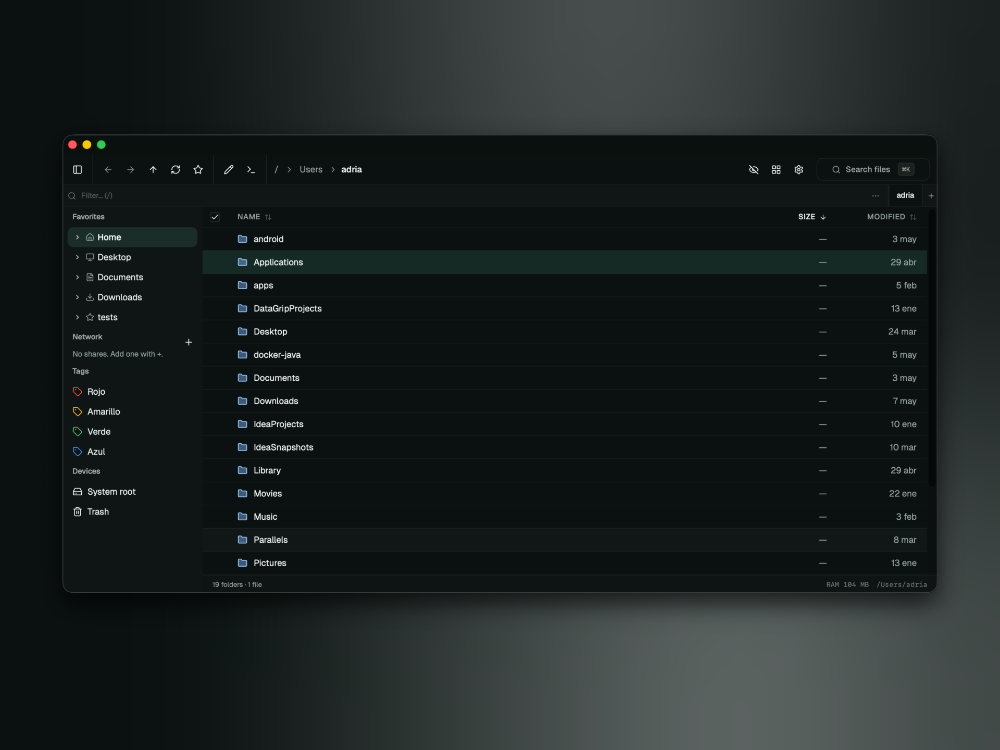

# Kenafold

A fast, keyboard-driven file manager for macOS, built with Tauri 2 + React 19.



---

## Installation

```bash
brew install --cask luqueee/kenafold/kenafold
```

First time? Add the tap once:

```bash
brew tap luqueee/kenafold
brew install --cask kenafold
```

Requires macOS 13 Ventura or later.

---

## CLI

Open Kenafold from the terminal with the `kenafold` command:

```bash
kenafold              # open at last session path
kenafold .            # open in the current directory
kenafold ~/Projects   # open at a specific path
```

**Install the CLI tool:**

```bash
sudo ln -sf "/Applications/Kenafold.app/Contents/Resources/scripts/kenafold" /usr/local/bin/kenafold
```

---

## Features

- **Dual-pane layout** with multi-tab navigation per pane
- **List & grid view** with virtualised rendering for large directories
- **Inline quick filter** — type to filter without leaving the keyboard
- **Preview pane** — images, video, PDF, code with syntax highlight, archives
- **Full keyboard control** — configurable hotkeys for every action
- **File operations** — copy, move, rename, delete (to Trash), with undo
- **Bulk rename** — regex/pattern tokens with live preview
- **Tags** — color-coded labels stored in SQLite, filterable from the sidebar
- **Archive support** — compress/decompress zip, tar.zst, tar.gz, tar.bz2 with progress
- **Folder comparator** — diff two directories by size, mtime, and SHA-256 hash
- **Disk usage panel** — treemap visualisation
- **SMB / network shares** — mount and browse shares from the sidebar
- **Native macOS notifications** — on long copy / archive operations

---

## Requirements

| Tool  | Version             |
| ----- | ------------------- |
| macOS | 13 Ventura or later |
| Rust  | stable (latest)     |
| Bun   | 1.x                 |

---

## Development

This is a monorepo managed with [Bun workspaces](https://bun.sh/docs/install/workspaces) and [Turbo](https://turbo.build/).

```
apps/
  app/    # Tauri 2 desktop app (React + Vite + Rust)
  web/    # Landing page (TanStack Router + Vite)
packages/
  ui/     # Shared shadcn components + Tailwind 4 theme (@kenafold/ui)
```

### Setup

```bash
bun install
```

### Commands

```bash
# Desktop app (Tauri + Rust + frontend hot-reload)
bun run dev:app

# Landing page
bun run dev:web

# Both in parallel
bun run dev

# Type-check all packages
bun run typecheck

# Lint all packages
bun run lint

# Tests
bun run test
```

From `apps/app/` directly:

```bash
bun run dev           # tauri dev (full app)
bun run dev:vite      # vite only (frontend, port 1420)
bun run test          # vitest
bun run test:e2e      # playwright
```

---

## Project structure

```
apps/app/
  src/features/
    file-explorer/   # main pane, selection, view modes, drag-drop
    filesystem/      # file ops, undo stack, directory listing
    hotkeys/         # global hotkey registry + user-configurable bindings
    navigation/      # history (back/forward), favorites
    search/          # full-text search palette (calls Rust grep)
    settings/        # user preferences panel
    sidebar/         # favorites + SMB shares
    smb/             # SMB/network share mounting
    tags/            # color-coded tags (SQLite)
  src-tauri/src/
    archive.rs       # compress / decompress
    comparator.rs    # folder diff
    fs.rs            # file operations + directory listing
    grep.rs          # ripgrep integration
    hash.rs          # SHA-256 / SHA-1 / MD5
    preview.rs       # file preview
    search.rs        # full-text search
    tags.rs          # SQLite tag storage
    watcher.rs       # FSEvents directory watcher

packages/ui/
  src/components/    # shadcn primitives
  globals.css        # Tailwind 4 theme tokens
```

---

## Tech stack

| Layer                   | Tech                                                        |
| ----------------------- | ----------------------------------------------------------- |
| Frontend                | React 19, TypeScript, Vite 7, TailwindCSS 4                 |
| Shared UI               | `@kenafold/ui` — shadcn/ui (Radix UI), lucide-react         |
| Tables / virtual scroll | TanStack Table + TanStack Virtual                           |
| Hotkeys                 | TanStack Hotkeys                                            |
| Drag & drop             | dnd-kit                                                     |
| Syntax highlight        | shiki (lazy-loaded)                                         |
| Charts                  | Recharts                                                    |
| Backend                 | Rust, Tauri 2                                               |
| Package manager         | Bun workspaces                                              |
| Monorepo                | Turbo 2                                                     |
| Tests                   | Vitest + @testing-library/react                             |

---

## License

MIT
